# Airline_Financial_Analysis
SQL and Power BI financial analytics project analyzing airline companies between 2019 and 2022 using SQL. This project aims to show the revenues, profitability, liquidity, leverage, asset efficiency, financial stability, and post-COVID performance. 

## Tools Used

- MySQL Workbench
- SQL
- Excel
- GitHub

## Project Structure

- `SQL/`: contains database scripts, data insertion scripts, and business queries.
- `screenshots/`: contains screenshots of SQL query results.
- `README.md`: presents the project overview, business questions, results, and insights.

## Database Overview
The database includes financial data from Aegean Airlines and British Airways for the period 2019-2022.

The main tables of the database are:
'companies'
'income_statements'
'balance_sheets'
'financial_ratios'
'airline_metrics_changes'

A SQL view named 'vw_financial' was created in order to include the tables of companies, income_statements, balance_sheets, financial_ratios into one table.

## Business Questions & SQL Results
### Query 1: Which company had the highest average revenue through the years?

** SQL Concepts Used:**

AVG, GROUP BY, ORDER BY

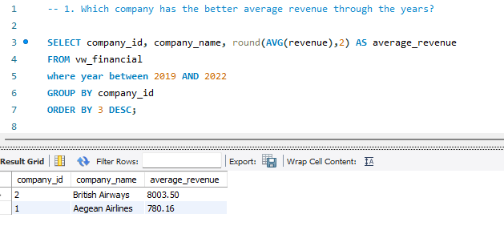

** Insight: ** 

British Airways had the highest average revenue through the years of 2019-2022. 

### Query 2: Which company had the highest revenues through the years?

** SQL Concepts Used:**

SUM, GROUP BY, ORDER BY

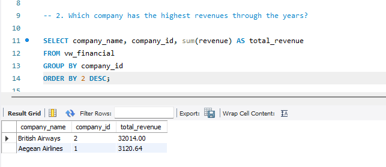 

** Insight: **

British Airways also had highest total revenues through the years of 2019-2022. 

### Query 3: Which year had the lowest revenue performance through the years?

** SQL Concepts Used:**

WHERE, ORDER BY

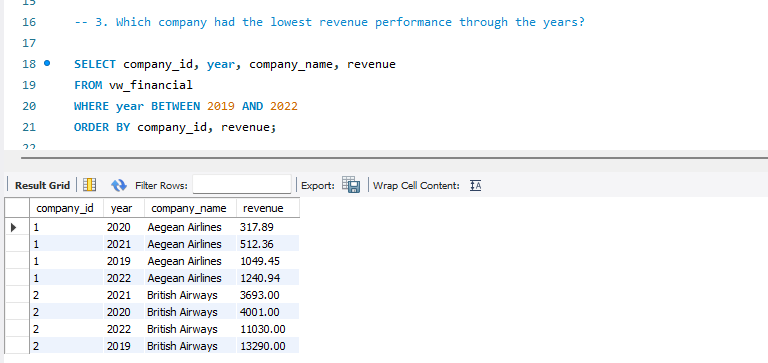

** Insight: **

Aegean Airlines recorded its lowest revenue during 2020. On the other hand, British Airways recorded its lowest revenue during 2021. This condition describes how heavily Aegean Airlines affected during the first pandemic crisis.

### Query 4: Which company had the highest average ROE?

** SQL Concepts Used:**

AVG, WHERE, GROUP BY, ORDER BY

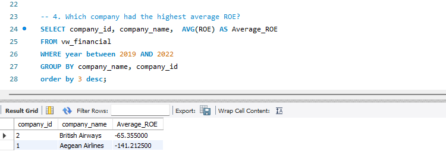

**Insight: **

British Airways had better Average ROE than Aegean Airlines. British Airways shareholder affected less than Aegean Airlines shareholder due to the pandemic crisis.  

### Query 5: Which company had the highest average liquidity?

** SQL Concepts Used:**

AVG, WHERE, GROUP BY

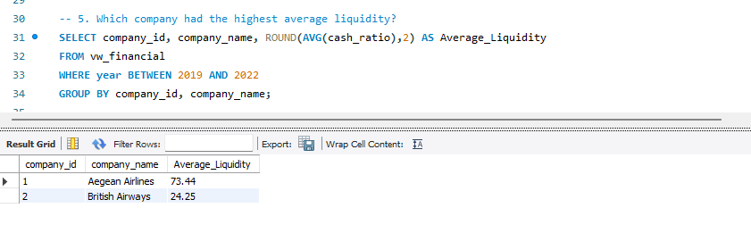

**Insight: **

Aegean Airlines had more liquidity than British Airways during 2019-2022. This mainly due to the fact that Aegean had more cash compared to its current liabilities.

### Query 6: Which company used its assets more efficiently based on average ROA and Asset Turnover between 2019 and 2022?

** SQL Concepts Used:**

AVG, WHERE, GROUP BY, ORDER BY

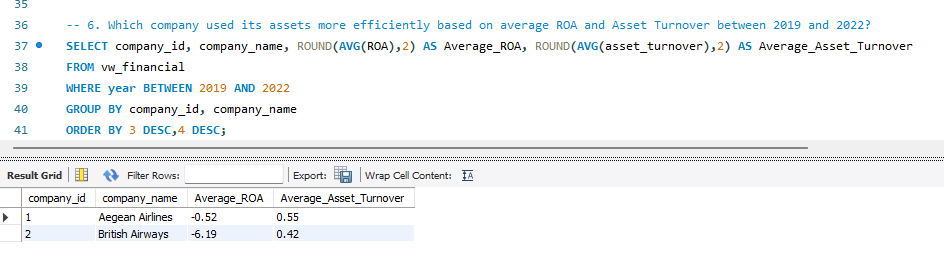

**Insight: **

Aegean Airlines was more efficient than British Airways during 2019-2022 on both Average ROA and Average Asset Turnover. This indicates from the fact that Aegean Airlines used its assets more efficient in order to generate revenue.

### Query 7:  Which company had the highest average finacial performance based on ROA, ROE, Net Profit Margin, Debt Ratio?

** SQL Concepts Used:**

AVG, WHERE, GROUP BY, ORDER BY

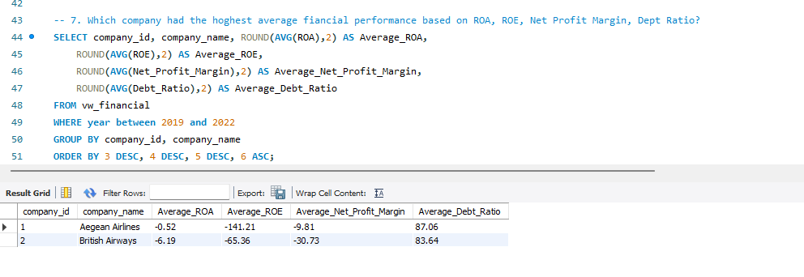

**Insight: **

Aegean Airlines had highest Average ROA than British Airways as we highligted before. This means that Aegean Airlines generated more revenue using one unit of its asset than British Airways. British Airways had highest Average ROE, fact which describes that its shareholder was affected less than Aegean Airlines. However, Average Net Profit was negative during 2019-2022, for both of the companies. This, indicated from the fact that both of the companies faced at least one year with negative Net Profit, due to Covid-19 conditions. Aegean Airlines presents highest Average Net Profit than British Airways throuhg the years. Also, Debt Ratio is a significant KPI which describes the leverage of Debt of every company. British Airways is more efficient, because it had less Average Debt than Aegean Airlines during 2019-2022. In conclusion, this query has mixed outcomes, and we can't highlight which one affected more. 

### Query 8: Which company had the lowest Average Debt Ratio through the years?

** SQL Concepts Used:**

AVG, WHERE, GROUP BY, ORDER BY

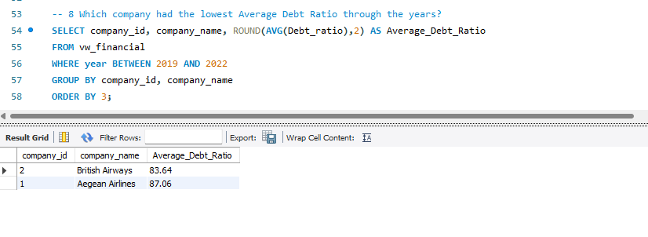

**Insight: **

British Airways recorded better performance in this KPI than Aegean Airlines through the years. This KPI shows the ability of each company to use its own assets to finance its liabilities. British Airways had lower amounts of Debt, fact that made her more efficient than Aegean Airlines.  

### Query 9:  Which company had better financial performance post-Covid?

** SQL Concepts Used:**

AVG, WHERE, GROUP BY, ORDER BY

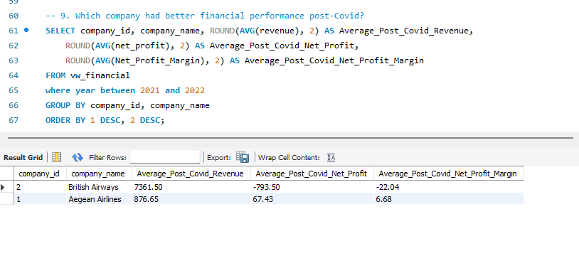

**Insight: **

This query aims to describe the perforamnce of each company after the pandemic crisis. British Airways had significant highest revenue though the years 2021-2022, fact which occured because of its popularity around the world. On the other hand, Aegean Airlines indicated higher average Net Profit and Net Profit Margin during 2021-2022. In conclusion, this query shows mixed outcomes as the fact that British Airways had better performance in terms of revenues, while Aegean Airlines was more effective in terms of Net Profit.

### Query 10:  Which company had better financial stability based on Altman Z-Score between 2019 and 2022?

** SQL Concepts Used:**

CASE, WHERE, ORDER BY

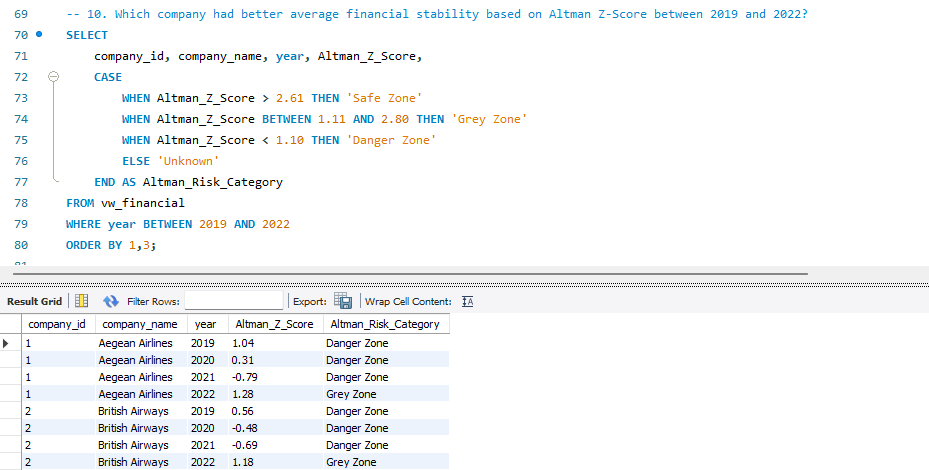

**Insight: **

This KPI is one of the most significant Kpi's of business. It shows the financial stability of each company, based on several indicators of balance sheets. We can examine outcomes by taking into account the Working Capital, Assets, Net Profit, EBITDA, Equity, Liadilities, Revenues. Both of the companies, were in Danger an Grey Zone across the years 2019-2020. During the pandemic crisis of 2020, both of them were in Danger Zone, fact which describes how difficult was the business envirnoment this year. Moreover, both of them were also in Danger Zone during 2021, while British Airways was in a better position than Aegean Airlines. In 2022, both companies improved and moved into the Grey Zone, indicating signs of financial recovery.

### Query 11: Which years did each company record net losses between 2019 and 2022?

** SQL Concepts Used:**

WHERE, AND, BETWEEN, ORDER BY

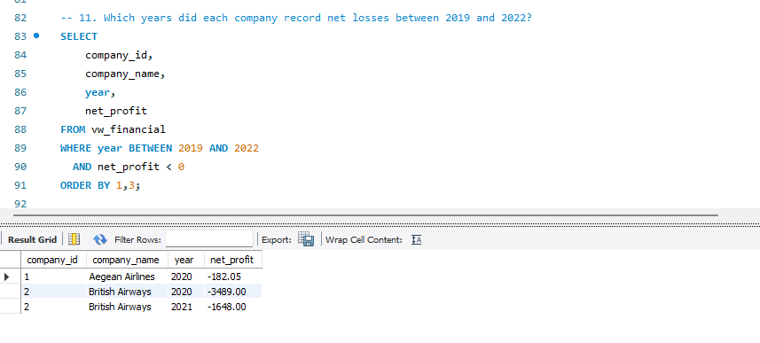 

**Insight: **

This indicator identifies the years of Net Losses of each company. The query outcomes, present a better performance of Aegean Airlines. This arised from the fact that Aegean Airlines recorded negative net profit only in 2020, while British Airways recorded negative outcomes in both 2020 and 2021. In conclusion, this query describes that both companies faced financial challenges due to Covid-19, but Aegean Airlines recovered faster in terms of Net Profit. 

### Query 12: How do the companies compare across key financial ratios between 2019 and 2022?

** SQL Concepts Used:**

AVG, WHERE, GROUP BY, UNION ALL, ORDER BY

**Insight: **

This query compares three financial KPI indicators: average ROE, average Cash Ratio, average Debt Ratio. British Airways had a higher average ROE, as we mentioned before. British Airways performed better in terms of average ROE, suggesting that its shareholder returns were less negatively affected compared to Aegean Airlines. Moreover, British Airways had more effective average Debt Ratio, fact which means that it used its assets more effectively than Aegean Airlines in order to coverage its current liabilities. On the other hand, Aegean Airlines showed a stonger average Cash Ratio than British Airways through the years. This indicator shows that the company was able to use its cash in order to cover its liabilites. Overall, the outcomes show mixed performance for each company.
